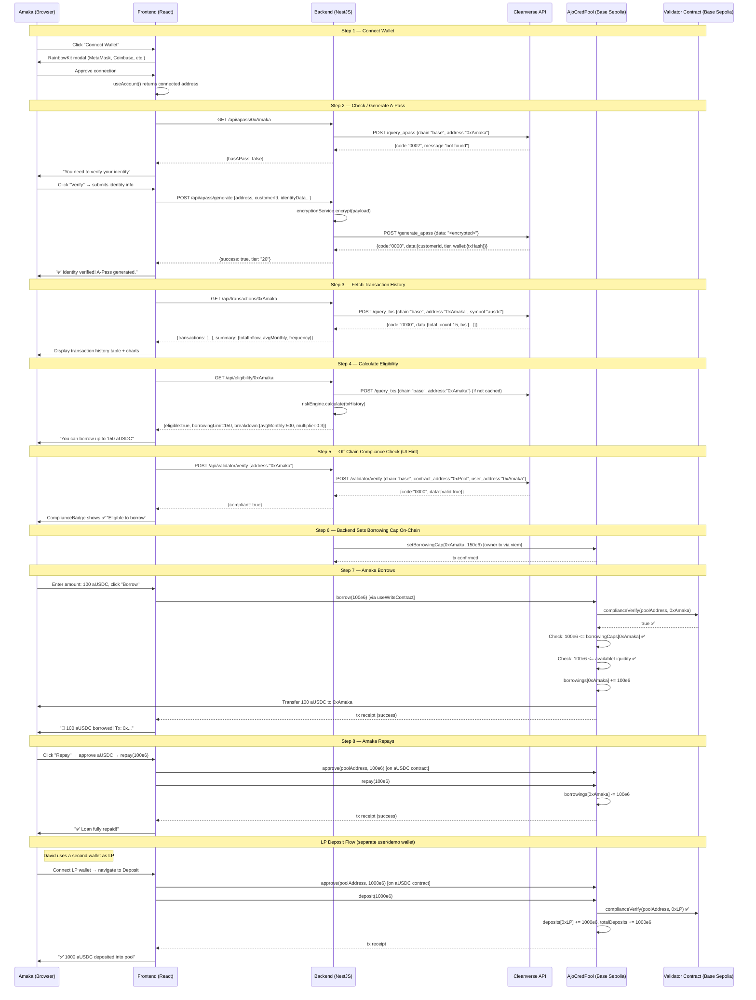

# AjoCred — Comprehensive Implementation Blueprint

## Phase 1: Project Understanding

### The Problem
Nigerians receiving regular diaspora remittances (stablecoin transfers from relatives abroad) have **real, provable income** that is invisible to the formal financial system. Without collateral or recognized credit history, they're locked out of bank credit and pushed toward predatory loan apps. There are billions of dollars flowing through diaspora remittance corridors, but this consistent income pattern is never used as a trust signal for credit.

### What AjoCred Does
AjoCred turns **on-chain remittance history into collateral-free credit**. It's a DeFi lending pool on Base (L2) that uses Cleanverse's identity (CVI) and asset (CVA) infrastructure as its trust layer:

1. A diaspora relative sends stablecoin (`ausdc` — a Cleanverse-wrapped USDC) to a Nigerian recipient's wallet
2. The recipient completes **one-time CVI verification** (A-Pass) — proving their identity via Cleanverse
3. Their **on-chain inflow history** (fetched via `query_txs`) becomes a transparent "credit file"
4. The `AjoCredPool` smart contract gates borrowing via Cleanverse's **on-chain Validator** (`complianceVerify`) — checking the wallet's A-Pass attributes against pool rules
5. Eligible wallets borrow **conservatively** against verified average monthly inflow — no collateral required
6. Liquidity comes from real depositors/LPs — this is a two-sided pool, not admin-seeded

### How Cleanverse Fits (CVI + CVA)

| Cleanverse Primitive | How AjoCred Uses It | Integration Depth |
|---|---|---|
| **CVI (A-Pass)** | Identity verification — trust root for the entire lending decision. Without it, can't distinguish real recipients from fake self-transfers | `generate_apass`, `query_apass` via REST API |
| **CVA (aUSDC)** | The token being transferred, deposited, and lent. Already a compliance-wrapped stablecoin | Existing `ausdc` A-Token — no issuance needed |
| **Validator (CCP)** | **On-chain compliance enforcement** — `complianceVerify()` called inline in `deposit()`, `borrow()`, `withdraw()` on our contract. Reverts if user doesn't qualify | On-chain `IAPassComplianceValidator` interface (Single-Contract Mode) |
| **Transaction History** | `query_txs` fetches indexed on-chain transfer records — feeds the **risk engine** for borrowing limit calculation | REST API |
| **Faucet** | Sandbox test funds for demo | REST API |

### What Happens On-Chain vs Off-Chain

| On-Chain | Off-Chain |
|---|---|
| `AjoCredPool` contract (deposit, borrow, repay, withdraw) | Cleanverse REST API calls (A-Pass generation, tx history queries) |
| `complianceVerify()` enforcement on every pool operation | Risk engine / eligibility calculation |
| `RuleV2` compliance rules on the pool | EIP-191 signature generation for validator registration |
| ERC-20 (`ausdc`) token transfers | AES encryption for sensitive Cleanverse endpoints |
| Event emissions for all pool operations | Backend API for frontend communication |

### Judging Criteria Alignment

| Criterion | Weight | Our Strategy |
|---|---|---|
| Concept & Problem Definition | 20 | Real problem, specific persona (Amaka in Lagos), data-backed |
| **Depth of CVI·CVA Integration** | **30** | **Both CVI and CVA deeply integrated. On-chain complianceVerify, REST A-Pass, REST tx history, CVA token as core asset** |
| Build Quality | 25 | Working, deployed, end-to-end on Base Sepolia testnet |
| UX & Demo | 15 | Story-driven demo following Amaka persona through full flow |
| Scalability Potential | 10 | Clear expansion path: multiple corridors, graduated limits, institutional LPs |

---

## Phase 2: MVP Design

### Core MVP Scope (Must Ship)

1. ✅ User connects wallet (RainbowKit)
2. ✅ User's A-Pass status is checked (`query_apass`) — if none, one is generated (`generate_apass`)
3. ✅ Transaction history retrieved (`query_txs`) and displayed
4. ✅ Eligibility calculated off-chain (risk engine) — borrowing limit shown
5. ✅ Compliance verified both off-chain (UI hint via `validator/verify`) and **on-chain** (`complianceVerify` in contract)
6. ✅ LP deposits into pool (compliance-gated)
7. ✅ User borrows from pool (compliance-gated, risk-engine-capped)
8. ✅ User repays loan
9. ✅ Dashboard shows pool TVL, loan status, tx history

### Explicitly Deferred (Post-Hackathon)

- Fiat ramp integration
- A-Token issuance (using existing `ausdc`)
- Multi-pool factory architecture
- Database persistence (PostgreSQL/Prisma)
- Advanced risk models
- Real KYC provider integration (Sumsub)
- Institutional deposit whitelisting

---

## Phase 3: Implementation Plans

---

### Plan 1: Smart Contracts

#### Architecture: Single Contract + Interface

```
contracts/
├── contracts/
│   ├── AjoCredPool.sol                    # Main lending pool
│   ├── interfaces/
│   │   └── IAPassComplianceValidator.sol   # Cleanverse's on-chain validator interface
│   └── mocks/
│       └── MockValidator.sol              # For local testing
├── scripts/
│   ├── deploy.ts                          # Deploy AjoCredPool to Base Sepolia
│   └── registerAndSetRule.ts              # Register pool with Cleanverse + set RuleV2
├── test/
│   └── AjoCredPool.ts                     # TypeScript integration tests
├── ignition/
│   └── modules/
│       └── AjoCredPool.ts                 # Hardhat Ignition module
└── hardhat.config.ts                      # Updated with Base Sepolia network
```

#### Why Only One Contract?

AjoCred is a single lending pool — **Single-Contract Mode** from the CCP guide. There is no factory, no multi-pool spinning. One contract keeps deployment simple, testing fast, and the integration surface tight. The `IAPassComplianceValidator` interface is Cleanverse's — we don't deploy it, we call the already-deployed Cleanverse Validator contract on Base Sepolia.

#### `IAPassComplianceValidator.sol` — The Interface (Not Deployed by Us)

```solidity
// SPDX-License-Identifier: MIT
pragma solidity ^0.8.24;

interface IAPassComplianceValidator {
    struct RuleV2 {
        bytes2 allowedGroup;
        bytes2 allowedSubGroup;
        uint8 minTier;
        uint8 minSubTier;
        uint256 poolCountryBitmap;
    }

    function complianceVerify(address pool, address user) external view returns (bool);
    function setRuleV2FromContract(RuleV2 calldata rule) external;
    function addRuleV2FromContract(RuleV2 calldata rule) external;
    function removeRuleV2FromContract(uint256 index) external;
    function getRulesV2(address pool) external view returns (RuleV2[] memory);
}
```

> **Junior note:** An "interface" in Solidity is like a TypeScript interface — it declares what functions exist on another contract without providing implementations. We tell our contract "there's a contract at this address that has these functions" — the actual implementation lives in Cleanverse's deployed Validator contract.

#### `AjoCredPool.sol` — The Main Contract

**Responsibilities:**
- Accept deposits from LPs (compliance-gated)
- Lend to verified borrowers (compliance-gated, amount-capped by owner)
- Accept repayments
- Allow withdrawals (compliance-gated, subject to available liquidity)
- Emit events for all operations (frontend tracking)
- Owner-only rule management (set/add/remove `RuleV2`)

**Storage Layout:**

| Variable | Type | Purpose |
|---|---|---|
| `validator` | `IAPassComplianceValidator` (immutable) | Reference to Cleanverse's on-chain Validator |
| `lendingToken` | `IERC20` (immutable) | The aUSDC token address |
| `deposits` | `mapping(address => uint256)` | LP deposit balances |
| `borrowings` | `mapping(address => uint256)` | Active loan balances per borrower |
| `borrowingCaps` | `mapping(address => uint256)` | Max borrow amount per user (set by owner/backend) |
| `totalDeposits` | `uint256` | Total pool TVL |
| `totalBorrowings` | `uint256` | Total outstanding loans |

**Functions:**

| Function | Access | Description |
|---|---|---|
| `constructor(address validator_, address token_)` | — | Sets immutable validator and token addresses |
| `deposit(uint256 amount)` | External, compliance-gated | LP deposits aUSDC into pool |
| `borrow(uint256 amount)` | External, compliance-gated | Borrower takes a loan (≤ cap, ≤ available liquidity) |
| `repay(uint256 amount)` | External | Borrower repays outstanding loan |
| `withdraw(uint256 amount)` | External, compliance-gated | LP withdraws deposited funds |
| `setBorrowingCap(address user, uint256 cap)` | Owner only | Backend sets max borrow amount after risk calculation |
| `setRuleV2FromContract(RuleV2)` | Owner only | Set compliance rule on Cleanverse Validator |
| `addRuleV2FromContract(RuleV2)` | Owner only | Add additional compliance rule |
| `removeRuleV2FromContract(uint256)` | Owner only | Remove compliance rule by index |
| `getRulesV2()` | View | Query current compliance rules |
| `getPoolStats()` | View | Returns totalDeposits, totalBorrowings, available liquidity |

**Events:**

```solidity
event Deposited(address indexed user, uint256 amount);
event Borrowed(address indexed user, uint256 amount);
event Repaid(address indexed user, uint256 amount);
event Withdrawn(address indexed user, uint256 amount);
event BorrowingCapSet(address indexed user, uint256 cap);
```

**Modifiers:**

```solidity
modifier onlyCompliant() {
    require(
        validator.complianceVerify(address(this), msg.sender),
        "AjoCred: A-Pass not qualified"
    );
    _;
}
```

> **Junior note:** A modifier is reusable code that runs before (or after) a function body. `onlyCompliant()` checks if the caller has a valid A-Pass before letting the function execute. If the check fails, the entire transaction reverts — the user's ETH gas is spent but no state changes happen.

**Security Considerations:**
- **Reentrancy**: Use checks-effects-interactions pattern (update balances before external calls). Consider OpenZeppelin's `ReentrancyGuard` for extra safety
- **Integer overflow**: Solidity 0.8+ has built-in overflow checks
- **Access control**: `Ownable` from OpenZeppelin for admin functions
- **Token approval**: Users must `approve()` the pool contract before deposit/repay (standard ERC-20 pattern)

**Deployment Order:**
1. Get Cleanverse Validator address for Base Sepolia (from their docs/support)
2. Get aUSDC token address for Base Sepolia
3. Deploy `AjoCredPool(validatorAddress, ausdcAddress)`
4. Run `registerAndSetRule.ts` script:
   - Generate EIP-191 signature: `personal_sign(keccak256("base" + contractAddress.toLowerCase()))`
   - Call `POST /validator/register` with encrypted payload
   - Call `setRuleV2FromContract()` on the contract with appropriate `RuleV2`

**Testing Strategy:**
- Local tests use `MockValidator` that always returns `true` (or configurable responses)
- Mock ERC-20 token for aUSDC
- Test all flows: deposit → borrow → repay → withdraw
- Test compliance gating: mock validator returning `false` → expect reverts
- Test edge cases: borrow > cap, borrow > available liquidity, withdraw > deposited
- Test events emission

---

### Plan 2: Backend (NestJS)

#### Folder Structure

```
backend/src/
├── main.ts                                 # Bootstrap, CORS, global pipes
├── app.module.ts                           # Root module importing all feature modules
├── config/
│   └── configuration.ts                    # Environment config schema
│
├── common/
│   ├── cleanverse/
│   │   ├── cleanverse.module.ts            # Exports CleanverseClient + Encryption
│   │   ├── cleanverse-client.service.ts    # HTTP client: postEncrypted() + postPlain()
│   │   └── encryption.service.ts           # AES-256-CBC encrypt/decrypt
│   └── contracts/
│       ├── contracts.module.ts             # Exports ContractClient
│       └── contract-client.service.ts      # viem PublicClient + WalletClient for Base Sepolia
│
├── apass/
│   ├── apass.module.ts
│   ├── apass.controller.ts                 # POST /api/apass/generate, GET /api/apass/:address
│   └── apass.service.ts                    # generate_apass, query_apass wrappers
│
├── transactions/
│   ├── transactions.module.ts
│   ├── transactions.controller.ts          # GET /api/transactions/:address
│   └── transactions.service.ts             # query_txs wrapper + data transformation
│
├── eligibility/
│   ├── eligibility.module.ts
│   ├── eligibility.controller.ts           # GET /api/eligibility/:address
│   └── eligibility.service.ts              # Risk engine: tx history → borrowing limit
│
├── validator/
│   ├── validator.module.ts
│   ├── validator.controller.ts             # POST /api/validator/verify
│   └── validator.service.ts                # validator/verify (off-chain UI hint)
│
├── pool/
│   ├── pool.module.ts
│   ├── pool.controller.ts                  # GET /api/pool/stats, POST /api/pool/set-cap
│   └── pool.service.ts                     # Read/write AjoCredPool.sol via viem
│
└── faucet/
    ├── faucet.module.ts
    ├── faucet.controller.ts                # POST /api/faucet/request
    └── faucet.service.ts                   # Faucet wrapper for demo
```

#### API Routes

| Method | Route | Purpose | Cleanverse API | Encryption? |
|---|---|---|---|---|
| `POST` | `/api/apass/generate` | Generate A-Pass for a wallet | `generate_apass` | ✅ Yes |
| `GET` | `/api/apass/:address` | Query A-Pass status | `query_apass` | ❌ No |
| `GET` | `/api/transactions/:address` | Get transaction history | `query_txs` | ❌ No |
| `GET` | `/api/eligibility/:address` | Calculate borrowing limit | `query_txs` (internal) | ❌ No |
| `POST` | `/api/validator/verify` | Check compliance (UI hint) | `validator/verify` | ❌ No |
| `GET` | `/api/pool/stats` | Pool TVL, total borrows | On-chain read | — |
| `POST` | `/api/pool/set-cap` | Set user borrowing cap | On-chain write | — |
| `POST` | `/api/faucet/request` | Request test tokens | `faucet` | ❌ No |

#### Services Deep Dive

**`cleanverse-client.service.ts`** — Central HTTP Client

```typescript
// Two methods — postEncrypted() and postPlain()
// Every Cleanverse call goes through this service
// Adds api-id header automatically
// Handles response code checking (0000 = success, else throw)
```

> **Junior note:** This is a "wrapper" service. Instead of every module knowing how to talk to Cleanverse directly, they all call this one service. If Cleanverse's API changes (different URL, different headers), you change one file instead of ten.

**`encryption.service.ts`** — AES Encryption

Exactly as specified in the project brief: AES/CBC/PKCS5Padding, 16 zero-byte IV, key = Base64-decoded `api-key`. Already has working code in the brief.

**`eligibility.service.ts`** — Risk Engine (The Core Business Logic)

```typescript
// 1. Fetch tx history via query_txs (last 6 months)
// 2. Filter to inbound transfers only (to_address === user's address)
// 3. Calculate:
//    - Total inflow volume
//    - Number of unique senders
//    - Frequency (transfers per month)
//    - Average monthly inflow
//    - Consistency score (how regular are the transfers?)
// 4. Apply conservative multiplier:
//    - Borrowing limit = averageMonthlyInflow × 0.3 (30% of average)
//    - Never exceed totalInflow × 0.15 (15% of total historical)
// 5. Return { eligible: boolean, borrowingLimit: number, breakdown: {...} }
```

> **Junior note:** The risk engine is deliberately conservative. In real lending, being too generous leads to defaults. For the hackathon, the formula doesn't need to be production-grade — it needs to be *reasonable, explainable, and demonstrate the concept*. The numbers above are starting points.

**`contract-client.service.ts`** — Blockchain Interaction

```typescript
// Uses viem's createPublicClient + createWalletClient
// PublicClient: read contract state (getPoolStats, getBorrowingCap, etc.)
// WalletClient: write transactions (setBorrowingCap — owner-only, signed by backend wallet)
// Chain: Base Sepolia
// RPC: Alchemy or Infura free tier
```

#### Environment Variables

```bash
# .env (backend — NEVER committed)
CLEANVERSE_API_ID=           # Sent as api-id header
CLEANVERSE_API_KEY=          # Used locally for AES encryption — NEVER sent over network
CLEANVERSE_BASE_URL=https://uatapi.cleanverse.com/api/cooperate

BASE_SEPOLIA_RPC_URL=        # Alchemy/Infura RPC for Base Sepolia
POOL_OWNER_PRIVATE_KEY=      # Wallet that deployed AjoCredPool (for setBorrowingCap)
POOL_CONTRACT_ADDRESS=       # Deployed AjoCredPool address
AUSDC_TOKEN_ADDRESS=         # aUSDC on Base Sepolia

PORT=3001                    # Backend port (frontend on 5173)
FRONTEND_URL=http://localhost:5173  # CORS origin
```

#### Error Handling

```typescript
// Every Cleanverse response is checked:
// code === "0000" → success
// code === "0001" → bad parameters → 400 to frontend
// code === "0002" → business failure → parse sub-code, return meaningful error
// HTTP 403 → invalid api-id → 500 (config error)
// Network errors → 503 (service unavailable)
```

#### No Database (Deliberate Decision — See Phase 5)

For the hackathon MVP, all state lives either on-chain (deposits, borrows, caps) or is fetched fresh from Cleanverse APIs (A-Pass status, tx history). This avoids migration overhead, schema debates, and sync bugs. The trade-off is that we re-fetch data on each request — acceptable for a demo with few users.

#### Testing Strategy

- Unit tests for `eligibility.service.ts` (mock tx data → expected limits)
- Unit tests for `encryption.service.ts` (known plaintext → ciphertext → plaintext)
- Integration test: mock Cleanverse API responses → verify controller outputs
- E2E: start the app, call endpoints, verify responses

---

### Plan 3: Frontend (Vite + React + TypeScript)

#### Folder Structure

```
frontend/src/
├── main.tsx                          # Entry point with providers
├── App.tsx                           # Router + layout
├── index.css                         # Global styles + design system
│
├── providers/
│   └── Web3Provider.tsx              # WagmiConfig + QueryClient + RainbowKit
│
├── pages/
│   ├── Landing.tsx                   # Hero, connect wallet CTA
│   ├── Onboard.tsx                   # A-Pass verification flow
│   ├── Dashboard.tsx                 # Main hub: tx history, eligibility, pool stats
│   ├── Deposit.tsx                   # LP deposit flow
│   └── Borrow.tsx                    # Loan request + repay
│
├── components/
│   ├── layout/
│   │   ├── Header.tsx                # Navigation + wallet button
│   │   └── Footer.tsx
│   ├── WalletConnect.tsx             # RainbowKit ConnectButton wrapper
│   ├── ComplianceBadge.tsx           # Shows A-Pass status (verified/unverified/expired)
│   ├── TxHistoryTable.tsx            # Transaction history with filters
│   ├── EligibilityCard.tsx           # Borrowing limit breakdown
│   ├── PoolStats.tsx                 # TVL, utilization, available liquidity
│   └── LoanStatus.tsx               # Active loan details + repay button
│
├── hooks/
│   ├── useAjoCredPool.ts             # Contract read/write hooks (wagmi useReadContract, useWriteContract)
│   ├── useAPass.ts                   # Fetch A-Pass status from backend
│   ├── useTransactions.ts            # Fetch tx history from backend
│   └── useEligibility.ts            # Fetch borrowing limit from backend
│
├── lib/
│   ├── wagmiConfig.ts                # Chain config, transports, connectors
│   ├── api.ts                        # Backend API client (fetch wrapper)
│   └── abi/
│       └── AjoCredPool.json          # Contract ABI (generated from Hardhat compile)
│
└── types/
    └── index.ts                      # Shared frontend types
```

#### Page Flow

```
Landing (/) → Connect Wallet
    ↓
Onboard (/onboard) → Check A-Pass → Generate if needed
    ↓
Dashboard (/dashboard) → View tx history, eligibility, pool stats
    ↓ (two paths)
Deposit (/deposit) → LP deposits aUSDC into pool
Borrow (/borrow) → Request loan (if eligible) → Repay
```

#### Component Hierarchy

```
App
├── Web3Provider (WagmiConfig + QueryClientProvider + RainbowKitProvider)
│   ├── Header (always visible — nav + ConnectButton)
│   ├── Routes
│   │   ├── Landing
│   │   │   └── WalletConnect (hero CTA)
│   │   ├── Onboard
│   │   │   └── ComplianceBadge
│   │   ├── Dashboard
│   │   │   ├── PoolStats
│   │   │   ├── EligibilityCard
│   │   │   ├── LoanStatus
│   │   │   └── TxHistoryTable
│   │   ├── Deposit
│   │   │   └── PoolStats
│   │   └── Borrow
│   │       ├── EligibilityCard
│   │       └── LoanStatus
│   └── Footer
```

#### Wallet Integration

- **wagmi v2** for React hooks: `useAccount`, `useConnect`, `useReadContract`, `useWriteContract`
- **RainbowKit** for connect button UI — zero custom wallet connection code needed
- **viem** under the hood (wagmi's transport layer)
- Chain: **Base Sepolia** testnet

> **Junior note:** wagmi is a library of React hooks for Ethereum. Instead of manually creating wallet connections, signing transactions, and tracking state, you use hooks like `useAccount()` to know if a wallet is connected and `useWriteContract()` to send transactions. RainbowKit adds the nice modal UI for choosing which wallet (MetaMask, Coinbase, etc.).

#### State Management

**No Redux, no Zustand — React Query + wagmi hooks are sufficient.**

- **Server state** (API data): React Query (`@tanstack/react-query`) — handles caching, refetching, loading/error states automatically
- **Contract state** (on-chain reads): wagmi's `useReadContract` — also uses React Query under the hood
- **Local UI state**: React `useState` — for form inputs, modals, tabs
- **Wallet state**: wagmi's `useAccount`, `useChainId` — reactive, auto-updates

> **Junior note:** React Query eliminates the need for `useEffect` + `useState` + loading flags for API calls. You declare "I need this data" and it handles everything: loading spinners, error retries, cache invalidation, refetching when the window refocuses.

#### API Communication — How Each Page Connects

| Page | Backend Endpoint | On-Chain Read/Write | What Happens |
|---|---|---|---|
| **Landing** | None | None | Static page, connect wallet CTA |
| **Onboard** | `GET /api/apass/:address` → `POST /api/apass/generate` | None | Check if A-Pass exists; if not, generate one |
| **Dashboard** | `GET /api/transactions/:address`, `GET /api/eligibility/:address` | `useReadContract(getPoolStats)`, `useReadContract(deposits[user])`, `useReadContract(borrowings[user])` | Display tx history, eligibility, pool info, active loans |
| **Deposit** | `POST /api/validator/verify` (UI hint) | `useWriteContract(deposit)` (preceded by `useWriteContract(approve)` on aUSDC) | Verify compliance → approve token → deposit |
| **Borrow** | `GET /api/eligibility/:address`, `POST /api/validator/verify` | `useWriteContract(borrow)` | Check eligibility → verify compliance → borrow → backend calls `setBorrowingCap` |

#### Loading/Error States

Every data-fetching component follows this pattern:
```tsx
const { data, isLoading, error } = useQuery(...);

if (isLoading) return <Skeleton />;     // Shimmer placeholder, not blank screen
if (error) return <ErrorCard message={...} retry={refetch} />;
return <ActualContent data={data} />;
```

Transaction states:
```tsx
// Pending → show spinner + "Waiting for wallet..."
// Confirming → show spinner + "Confirming on Base..."
// Success → show green check + link to BaseScan
// Error → show red banner + error message + retry button
```

#### UX Considerations

- **Mobile-responsive** — demo might be shown on a phone
- **Dark mode** — premium feel, easier on judges' eyes in dim rooms
- **Toast notifications** for transaction confirmations
- **Skeleton loaders** instead of blank screens
- **Disable buttons** when prerequisites aren't met (no wallet, no A-Pass, insufficient funds)
- **Tooltips** explaining DeFi terms for the demo narrative
- **Progress indicator** on the Onboard page showing verification steps

---

## Phase 4: End-to-End System Flow

### Complete Sequence — Amaka's Journey



### Data Flow Summary

```
User's Wallet ←→ Frontend (React) ←→ Backend (NestJS) ←→ Cleanverse REST API
                       ↕                     ↕
              AjoCredPool.sol         Cleanverse Validator
              (Base Sepolia)           (Base Sepolia)
```

- **Frontend → Backend**: REST API calls (fetch/axios)
- **Frontend → Blockchain**: wagmi hooks → viem → JSON-RPC → Base Sepolia
- **Backend → Cleanverse**: HTTP POST with api-id header (encrypted or plain)
- **Backend → Blockchain**: viem WalletClient → JSON-RPC → Base Sepolia
- **Smart Contract → Validator**: Direct Solidity call to `complianceVerify()`

---

## Phase 5: Technical Decisions

### 1. Why NestJS Over Fastify?

**Alternatives:** Express (bare), Fastify (David's more familiar stack), Hono, Koa

**Why NestJS wins for this project:**
- Cleanverse's API splits into clean modules (A-Pass, Validator, Common Queries) — maps naturally onto NestJS feature modules
- Dependency injection makes services testable without complex mocking
- `@nestjs/config` gives typed environment variables out of the box
- Module structure enforces separation of concerns — the `cleanverse/` module is reused by `apass/`, `transactions/`, `validator/`, `faucet/`
- The project brief explicitly chose NestJS with clear rationale

**Trade-off:** Steeper learning curve than Fastify. Mitigated by starting with the scaffold that's already in place.

**Risk:** Over-engineering for a hackathon. Mitigated by keeping modules thin — no custom decorators, no pipes, no interceptors beyond what's needed.

### 2. Why Hardhat Over Foundry?

**Alternatives:** Foundry (Forge), Truffle (deprecated), Remix (IDE only)

**Why Hardhat:**
- Already initialized in the repo with Hardhat 3 + viem toolbox
- TypeScript throughout — no context-switching to Rust-flavored Forge commands
- Hardhat Ignition for deployment — cleaner than raw scripts
- David has zero prior EVM experience; Hardhat's error messages are more beginner-friendly
- `forge-std` cheatcodes still available in Hardhat 3 for Solidity unit tests

**Trade-off:** Foundry is faster for large test suites and has better gas analysis. For one contract with ~10 tests, this doesn't matter.

### 3. Why viem Over ethers.js?

**Alternatives:** ethers.js v5, ethers.js v6, web3.js

**Why viem:**
- Already in the repo (both `contracts/` and `backend/` depend on it)
- wagmi v2 uses viem under the hood — no need for two Ethereum libraries
- Better TypeScript types — ABI-typed contract interactions catch errors at compile time
- Smaller bundle size than ethers.js
- Better error messages (critical for a beginner)

**Trade-off:** Smaller community than ethers.js, fewer Stack Overflow answers. Mitigated by excellent official docs.

### 4. Why Keep Eligibility Calculation Off-Chain?

**Alternatives:** On-chain oracle, on-chain risk calculation, ZK proof of income

**Why off-chain:**
- Transaction history comes from Cleanverse's REST API (`query_txs`) — there's no on-chain oracle for it
- Risk calculation involves floating-point math (averages, multipliers) — expensive and awkward on-chain
- The calculation parameters need to be adjustable without redeploying a contract
- On-chain enforcement still happens: the `borrowingCap` is set on-chain by the owner (backend), and `borrow()` checks against it

**Trade-off:** The backend is a trusted intermediary for the risk calculation. Acceptable for hackathon; in production, you'd add transparency (publish the formula, let users verify inputs).

### 5. Why No Database?

**Alternatives:** PostgreSQL + Prisma, SQLite, MongoDB

**Why no database for MVP:**
- All critical state lives on-chain (deposits, borrows, caps)
- User identity is on Cleanverse (A-Pass)
- Transaction history is on Cleanverse (`query_txs`)
- Adding a database means: schema design, migrations, ORM setup, sync logic — at least 4 hours of work that doesn't show in the demo
- For a hackathon demo with < 5 test users, re-fetching data on each request is fine

**When to add it (post-hackathon):** When you need audit logs, loan history, user preferences, or performance caching.

### 6. Why Monorepo?

**Alternatives:** Three separate repos, npm workspaces (what we have), Turborepo, Nx

**Why monorepo with npm workspaces:**
- Already set up in `package.json` with workspaces
- Shared types between frontend/backend (the `shared/` package)
- One `npm install` at the root installs everything
- Contract ABIs generated in `contracts/` can be directly imported by `backend/` and `frontend/`
- For a solo builder, there's zero reason to split repos

**Trade-off:** npm workspaces is the simplest monorepo tool — no task caching (Turborepo), no sophisticated dep graph (Nx). For a 3-package project, this is a feature, not a limitation.

### 7. Why React Query Over useEffect + useState?

**Alternatives:** Manual fetch with `useEffect`, SWR, Apollo Client

**Why React Query:**
- Already installed (`@tanstack/react-query` in `frontend/package.json`)
- Eliminates boilerplate: no manual loading/error state management
- Automatic caching — navigating between pages doesn't re-fetch everything
- Automatic refetching on window focus — always fresh data in the demo
- wagmi hooks are built on React Query — consistent mental model

**Trade-off:** Additional dependency. Already present, so no cost.

### 8. Why Base Sepolia Over Base Mainnet?

**Alternatives:** Base Mainnet, Hardhat local network, Monad

**Why Base Sepolia:**
- Cleanverse supports Base as a chain
- Free testnet ETH for gas (from faucets)
- Free test aUSDC from Cleanverse's faucet endpoint
- Real on-chain transactions that judges can verify on BaseScan
- Monad was considered but rejected: newer, less documentation, riskier for a solo builder with zero EVM experience

**Trade-off:** Testnets can be unreliable (slow, congested). Base Sepolia is generally stable.

---

## Phase 6: Junior-Friendly Concepts

### What is an A-Pass?
An A-Pass is Cleanverse's on-chain identity credential (CVI = Cleanverse Verified Identity). Think of it as a digital passport that lives on the blockchain. It proves a wallet belongs to a verified human, has a tier level (how thoroughly verified they are), and includes country information from their identity documents.

### What is aUSDC?
aUSDC is Cleanverse's compliance-wrapped version of USDC (a stablecoin pegged 1:1 to the US Dollar). It's an "A-Token" — an ERC-20 token with built-in compliance rules. For AjoCred, we use the existing aUSDC that's already deployed on Base; we don't issue our own.

### What is a Validator?
The Cleanverse Validator is a smart contract already deployed on Base that stores compliance rules for registered pools. When our `AjoCredPool` calls `complianceVerify(poolAddress, userAddress)`, the Validator checks: "Does this user's A-Pass attributes (tier, group, country) match the rules set for this pool?" If yes, the function returns `true`. If no, it returns `false` and our contract reverts.

### What is "Compliance Gating"?
It means restricting who can use certain functions. In our case, `deposit()`, `borrow()`, and `withdraw()` all require the caller to pass compliance verification. This happens on-chain — it's not a backend check that can be bypassed.

### Why Two Compliance Checks (REST + On-Chain)?
- **REST `validator/verify`** = "Hey Cleanverse, would this user pass?" Used in the UI to show "you're eligible" before the user even submits a transaction. Saves the user gas money if they'd fail.
- **On-chain `complianceVerify`** = The actual enforcement. Happens inside the smart contract when the transaction executes. Cannot be bypassed, cannot be faked.

### What is a "Two-Sided Pool"?
Traditional lending apps have a bank behind them. AjoCred has a **pool** — anyone can deposit funds (becoming a "liquidity provider" or LP), and those deposited funds are what borrowers borrow from. This is how DeFi lending works (Aave, Compound, etc.). For the demo, David uses a second wallet to play the LP role.

### What Does `approve()` Do?
In ERC-20 tokens, you can't just take someone's tokens. The token owner must first `approve()` a spender address to move up to a certain amount. So before depositing 100 aUSDC into the pool, the user calls `ausdc.approve(poolAddress, 100)` — "I allow the pool contract to take up to 100 of my aUSDC." Then the pool's `deposit()` function calls `ausdc.transferFrom(user, pool, 100)`.

### Why Does Each NestJS Module Exist?

| Module | Why It Exists |
|---|---|
| `common/cleanverse/` | Centralized Cleanverse API communication — encryption, HTTP, error handling. Every other module depends on this. |
| `common/contracts/` | Centralized blockchain interaction via viem. Pool reads/writes go through here. |
| `apass/` | Handles identity verification — the first thing a user does. |
| `transactions/` | Fetches on-chain tx history from Cleanverse — the data that feeds eligibility. |
| `eligibility/` | The risk engine — transforms raw tx data into a borrowing decision. This is the core business logic. |
| `validator/` | Off-chain compliance checking for UI previews. |
| `pool/` | Reads pool state and sets borrowing caps on-chain. |
| `faucet/` | Gets test tokens during development and demo. |

### What Happens When a Request Flows Through the App?

Example: User clicks "Check Eligibility"

1. **Frontend**: `useEligibility(address)` hook fires → calls `fetch('/api/eligibility/0xAmaka')`
2. **Backend Controller**: `EligibilityController.getEligibility(address)` receives the request
3. **Backend Service**: `EligibilityService.calculate(address)` is called
4. **Inside the service**: It calls `TransactionsService.getHistory(address)` (which calls Cleanverse's `query_txs`)
5. **Risk calculation**: Filters inbound transfers, calculates averages, applies multiplier
6. **Response**: `{ eligible: true, borrowingLimit: 150, breakdown: {...} }` flows back through controller → HTTP → frontend
7. **Frontend**: `useEligibility` hook updates, component re-renders with the data

---

## Phase 7: Incremental Development Plan

### Milestone 1: Smart Contract Foundation
**Objective:** Deploy a working `AjoCredPool` contract locally with mock validator

**Files to create:**
- `contracts/contracts/interfaces/IAPassComplianceValidator.sol`
- `contracts/contracts/AjoCredPool.sol`
- `contracts/contracts/mocks/MockValidator.sol`
- `contracts/contracts/mocks/MockERC20.sol`
- `contracts/test/AjoCredPool.ts`

**Dependencies:** Existing Hardhat 3 setup, OpenZeppelin contracts (install)

**Estimated effort:** 3-4 hours

**Definition of done:**
- All tests pass locally: deposit, borrow, repay, withdraw, compliance revert, cap enforcement
- Events emitted correctly
- Edge cases covered (borrow > cap, withdraw > balance, zero amounts)

**Verification:** `npx hardhat test` — all green

---

### Milestone 2: Backend Cleanverse Integration
**Objective:** Backend can talk to Cleanverse API — A-Pass, tx history, validator verify

**Files to create:**
- `backend/src/config/configuration.ts`
- `backend/src/common/cleanverse/cleanverse.module.ts`
- `backend/src/common/cleanverse/cleanverse-client.service.ts`
- `backend/src/common/cleanverse/encryption.service.ts`
- `backend/src/apass/apass.module.ts`, `apass.controller.ts`, `apass.service.ts`
- `backend/src/transactions/transactions.module.ts`, `transactions.controller.ts`, `transactions.service.ts`
- `backend/src/validator/validator.module.ts`, `validator.controller.ts`, `validator.service.ts`
- `backend/src/faucet/faucet.module.ts`, `faucet.controller.ts`, `faucet.service.ts`
- `backend/.env.example`

**Dependencies:** Milestone 1 not required (parallel work). Requires `@nestjs/config`, `@nestjs/axios` (or native fetch).

**Estimated effort:** 4-5 hours

**Definition of done:**
- `curl localhost:3001/api/apass/0xDeadAddress` returns Cleanverse response (or "not found")
- `curl localhost:3001/api/transactions/0xSomeAddress` returns transaction list
- `curl -X POST localhost:3001/api/validator/verify` returns compliance result
- Encryption service correctly encrypts/decrypts test payloads

**Verification:** Manual curl tests against running backend + Cleanverse sandbox

---

### Milestone 3: Eligibility Engine + Pool Integration
**Objective:** Backend calculates borrowing limits and can read/write pool contract

**Files to create:**
- `backend/src/eligibility/eligibility.module.ts`, `eligibility.controller.ts`, `eligibility.service.ts`
- `backend/src/common/contracts/contracts.module.ts`, `contract-client.service.ts`
- `backend/src/pool/pool.module.ts`, `pool.controller.ts`, `pool.service.ts`
- `shared/types.ts` (shared types for eligibility response, pool stats)

**Dependencies:** Milestone 2 (needs transactions service). Milestone 1 (needs deployed contract for pool reads).

**Estimated effort:** 3-4 hours

**Definition of done:**
- `GET /api/eligibility/0xAmaka` returns calculated borrowing limit with breakdown
- `GET /api/pool/stats` returns pool TVL, total borrows, available liquidity
- `POST /api/pool/set-cap` sets borrowing cap on-chain

**Verification:** curl tests + check on-chain state via BaseScan

---

### Milestone 4: Frontend — Wallet Connect + Onboarding
**Objective:** User can connect wallet and complete A-Pass verification

**Files to create:**
- `frontend/src/providers/Web3Provider.tsx`
- `frontend/src/lib/wagmiConfig.ts`
- `frontend/src/lib/api.ts`
- `frontend/src/pages/Landing.tsx`
- `frontend/src/pages/Onboard.tsx`
- `frontend/src/components/layout/Header.tsx`
- `frontend/src/components/WalletConnect.tsx`
- `frontend/src/components/ComplianceBadge.tsx`
- `frontend/src/hooks/useAPass.ts`
- Install: `react-router-dom`

**Dependencies:** Milestone 2 (backend A-Pass endpoints)

**Estimated effort:** 3-4 hours

**Definition of done:**
- Landing page renders with "Connect Wallet" button
- RainbowKit modal opens and connects MetaMask
- Onboard page checks A-Pass status and shows result
- Navigation between pages works

**Verification:** Open browser, connect wallet, see A-Pass status

---

### Milestone 5: Frontend — Dashboard + Deposit + Borrow
**Objective:** Complete frontend with all pages functional

**Files to create:**
- `frontend/src/pages/Dashboard.tsx`
- `frontend/src/pages/Deposit.tsx`
- `frontend/src/pages/Borrow.tsx`
- `frontend/src/components/TxHistoryTable.tsx`
- `frontend/src/components/EligibilityCard.tsx`
- `frontend/src/components/PoolStats.tsx`
- `frontend/src/components/LoanStatus.tsx`
- `frontend/src/hooks/useAjoCredPool.ts`
- `frontend/src/hooks/useTransactions.ts`
- `frontend/src/hooks/useEligibility.ts`
- `frontend/src/lib/abi/AjoCredPool.json`
- `frontend/src/types/index.ts`
- `frontend/src/components/layout/Footer.tsx`

**Dependencies:** Milestones 3 + 4 (backend eligibility + pool endpoints, frontend foundation)

**Estimated effort:** 5-6 hours

**Definition of done:**
- Dashboard shows transaction history, eligibility, pool stats
- Deposit page: approve → deposit → see updated TVL
- Borrow page: check eligibility → borrow → see loan status
- Repay flow: approve → repay → see loan cleared
- Loading states, error states, transaction confirmations all working

**Verification:** Full flow in browser: connect → verify → deposit (LP wallet) → borrow → repay

---

### Milestone 6: Deploy to Base Sepolia + Register with Validator
**Objective:** Contract deployed on real testnet, registered with Cleanverse Validator

**Files to create/update:**
- Update `contracts/hardhat.config.ts` (add Base Sepolia network)
- `contracts/scripts/deploy.ts`
- `contracts/scripts/registerAndSetRule.ts`
- `contracts/ignition/modules/AjoCredPool.ts`

**Dependencies:** Milestones 1-5 (everything working locally)

**Estimated effort:** 2-3 hours

**Definition of done:**
- Contract deployed to Base Sepolia (address in `.env`)
- Pool registered with Cleanverse Validator (`validator/is_register` returns true)
- Compliance rule set (`validator/rules` returns our rule)
- End-to-end flow works on testnet (not just localhost)

**Verification:** All transactions visible on BaseScan. `validator/verify` returns `true` for a wallet with a valid A-Pass.

---

### Milestone 7: Polish, Demo Script, Submission
**Objective:** Demo-ready product with compelling UX

**Tasks:**
- Responsive design audit + fixes
- Error message improvements
- Transaction status toasts
- Landing page copy and branding
- Demo script walkthrough (Amaka persona)
- README update (setup instructions, architecture diagram)
- Submission summary document
- Record demo video if needed

**Dependencies:** Milestone 6 (deployed and working on testnet)

**Estimated effort:** 3-4 hours

**Definition of done:**
- Full Amaka demo flows without errors
- No console errors, no broken states
- README explains how to set up and run
- Submission materials ready

**Verification:** Run through the demo script end-to-end 3 times without issues.

---

## Phase 8: Constraints Checklist

- [x] Working demo > Perfect architecture
- [x] Cleanverse integration is deep (CVI + CVA + on-chain Validator + REST APIs)
- [x] Clean module structure (NestJS modules, React components, single Solidity contract)
- [x] Good DX (TypeScript everywhere, hot reload, clear errors)
- [x] Easy debugging (centralized error handling, event emissions, console logging)
- [x] Easy future expansion (add modules for ramp, add contracts for multi-pool, add database later)
- [x] Battle-tested libraries only (NestJS, wagmi, viem, RainbowKit, React Query, OpenZeppelin)
- [x] No over-engineering (no database, no custom auth, no complex state management, no factory pattern)

> [!IMPORTANT]
> **Open Questions for David:**
> 1. Do you have the Cleanverse Sandbox API credentials (api-id and api-key) ready in `.env`? The curl sanity check from the project brief should be done first.
> 2. Do you know the Cleanverse Validator contract address on Base Sepolia? We need this for the `AjoCredPool` constructor. It should be in the CCP docs or obtainable from Cleanverse support.
> 3. Do you know the aUSDC token contract address on Base Sepolia? Needed for the pool to handle token transfers.
> 4. Do you have a funded wallet on Base Sepolia for deployment? You'll need testnet ETH for gas.
> 5. What's your preferred RPC provider for Base Sepolia — Alchemy, Infura, or Base's public RPC?
> 6. Should I start with Milestone 1 (smart contracts) or Milestone 2 (backend) first? They can run in parallel but you might prefer to validate the Cleanverse API connection before writing the contract.
