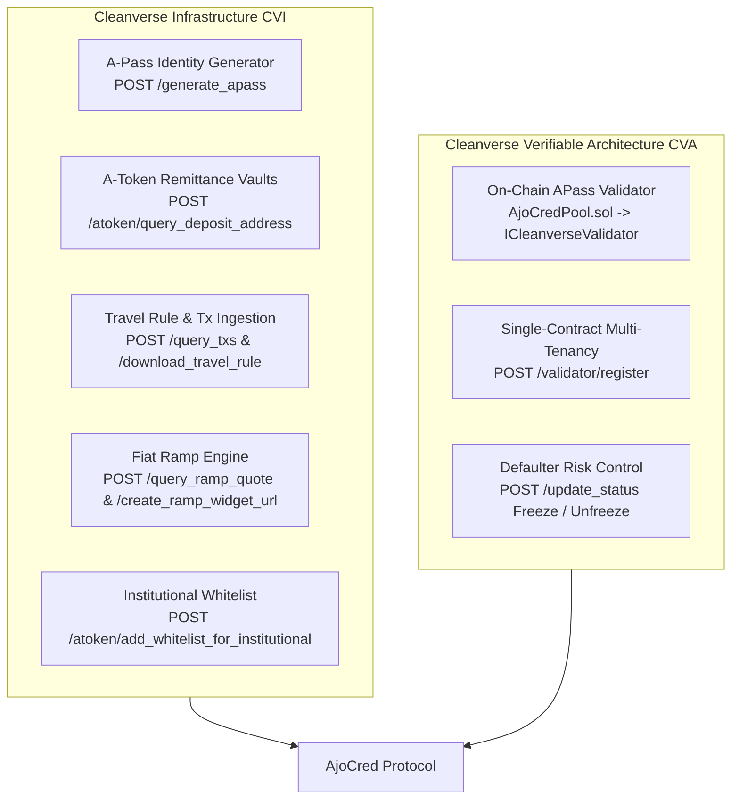

# AjoCred — One-Page Executive Summary & CVI·CVA Integration Report

> **Project Name:** AjoCred  
> **Team Name:** Team AjoCred  
> **Target Audience:** Cleanverse Hackathon Judges  
> **Deployed Chain:** Base Sepolia Testnet (Chain ID `84532`)  
> **Live Web App:** [ajocred.vercel.app](https://ajocred.vercel.app)  

---

## 1. Problem Statement

Across developing markets—particularly in Sub-Saharan Africa—over **70% of diaspora remittance recipients** are excluded from formal banking credit. Despite receiving regular, verifiable monthly inbound funds ($30B+ annually in Nigeria alone), recipients have **zero traditional credit history**, forcing them into predatory informal lenders or requiring 150%+ physical asset collateral.

Conversely, local financial cooperatives (*Ajo* / *Esusu* groups and credit unions) want to lend to low-risk community members, but lack a compliance-grade framework to verify identity, assess creditworthiness, or enforce cross-border compliance.

---

## 2. Solution: AjoCred

**AjoCred** bridges diaspora remittance flows with decentralized cooperative credit. It converts a recipient's verified remittance history into a **verifiable, collateral-free credit score and borrowing cap** backed by institutional liquidity pools.

- **Remittance-Backed Credit Scoring:** Calculates eligibility based on 6-month lookback remittance frequency, transaction volume, and Cleanverse A-Pass identity tiers.
- **Multi-Tenant Cooperative Lending:** Financial cooperatives register custom lending pools on-chain with tailored risk parameters (liquidity caps, interest rates, minimum A-Pass tiers).
- **Embedded Web3 UX:** Dual sign-in via Coinbase Developer Platform (CDP) embedded email wallets or standard Web3 wallets (MetaMask, Coinbase Wallet).
- **Institutional Compliance & Off-Ramping:** Institutional deposit whitelisting, ISO 20022 Travel Rule compliance export, and direct fiat cash-out to local bank accounts (e.g., NGN).

---

## 3. Deep CVI & CVA Integration Points

AjoCred is architected from the ground up around **Cleanverse Infrastructure (CVI)** and **Cleanverse Verifiable Architecture (CVA)**.

### A. Cleanverse Infrastructure (CVI) Integration (5 Modules)

1. **A-Pass Identity Verification Module (`backend/src/apass/`)**:
   - **Cleanverse Endpoints:** `POST /generate_apass`, `POST /query_apass`
   - **Mechanism:** Encrypts identity payloads via AES-256-CBC using `CLEANVERSE_AES_KEY`. Issues a verifiable, self-custodial on-chain A-Pass bound to the member's wallet.

2. **A-Token Remittance Vault Accounting (`backend/src/faucet/` & `backend/src/pool/`)**:
   - **Cleanverse Endpoints:** `POST /atoken/query_deposit_address`, `POST /atoken/query_deposit_atoken_list`, `POST /faucet/request`
   - **Mechanism:** Assigns dedicated Cleanverse deposit vaults to capture real inbound diaspora remittance flows in stablecoins (`aUSDC`), establishing verifiable on-chain deposit provenance.

3. **Remittance Transaction Ingestion & Travel Rule Export (`backend/src/transactions/`)**:
   - **Cleanverse Endpoints:** `POST /query_txs`, `POST /atoken/download_travel_rule`
   - **Mechanism:** Ingests historical inbound transfers, parses ISO 20022 remittance metadata, evaluates lookback deposit frequencies (e.g. 6-month observation window), and generates regulatory Travel Rule compliance reports for auditing.

4. **Cleanverse Fiat Ramp Integration (`backend/src/ramp/`)**:
   - **Cleanverse Endpoints:** `POST /query_ramp_quote`, `POST /create_ramp_widget_url`, `GET /query_ramp_order_status`, `GET /query_ramp_payment_methods`
   - **Mechanism:** Enables remittance recipients to off-ramp borrowed or received funds directly into local fiat currency (e.g., NGN bank accounts) backed by A-Pass identity checks.

5. **Institutional Deposit Whitelist Module (`backend/src/whitelist/`)**:
   - **Cleanverse Endpoints:** `POST /atoken/add_whitelist_for_institutional`, `POST /atoken/remove_whitelist_for_institutional`, `POST /atoken/restore_whitelist_for_institutional`, `GET /atoken/whitelist_addresses`
   - **Mechanism:** Provides cooperative admins with encrypted, institutional-grade access controls to register, deactivate, or restore approved liquidity provider source wallets.

---

### B. Cleanverse Compliance / Verifiable Architecture (CVA) Integration (3 Modules)

1. **On-Chain A-Pass Validator Pre-Execution Check (`contracts/AjoCredPool.sol`)**:
   - **Contract Integration:** `ICleanverseValidator.verifyUser(address userAddress)`
   - **Mechanism:** Every `borrow(coopId, amount)` transaction in `AjoCredPool.sol` executes a real-time, on-chain call to Cleanverse's Validator contract (`0xaC7e5179C2C7f03f209136886c172eb34F161792`). Loans are strictly reverted on-chain if the borrower does not hold an active, non-frozen A-Pass matching the cooperative's minimum required tier.

2. **Single-Contract Multi-Tenant Registration (`docs/project-brief.md`)**:
   - **Cleanverse Endpoint:** `POST /validator/register`
   - **Mechanism:** Registers the core `AjoCredPool` smart contract address with Cleanverse's global Validator architecture, establishing a single, audit-friendly CVA compliance checkpoint while internally partitioning cooperative pools via mapping data structures.

3. **Cooperative Defaulter Risk Control (`backend/src/admin/`)**:
   - **Cleanverse Endpoint:** `POST /update_status`
   - **Mechanism:** Allows cooperative administrators to trigger real-time, AES-256 encrypted status updates to freeze a defaulting member's A-Pass across the Cleanverse network, preventing bad actors from taking loans in other cooperatives.

---

## 4. Deployed Testnet Infrastructure

| Asset / Contract | Network | Address |
| :--- | :--- | :--- |
| **AjoCredPool (v2 Multi-Tenant Pool)** | Base Sepolia (`84532`) | `0x2d24b34cf7cae0fc2b6620e956ff09ea61f3b215` |
| **Cleanverse Validator Contract** | Base Sepolia (`84532`) | `0xaC7e5179C2C7f03f209136886c172eb34F161792` |
| **aUSDC Token (Collateral & Credit)** | Base Sepolia (`84532`) | `0xaC0893567D43C3E7e6e35a72803df05416C1f20D` |
| **Backend API Service** | NestJS Service | `https://ajocred.onrender.com` |
| **Member Web App** | React / Vite | `https://ajocred.vercel.app` |
| **Cooperative Admin Dashboard** | React / Vite | `https://ajocred-admin.vercel.app` |

---

## 5. Summary Matrix: Hackathon Requirements

- **Commit History:** Continuous commit history across all 7 milestones during the hacking window.
- **CVI & CVA Depth:** 8 integrated Cleanverse modules spanning identity, vault accounting, credit scoring, Travel Rule, fiat ramping, institutional whitelisting, on-chain validator verification, and defaulter risk management.
- **Build Quality:** Fully typed end-to-end TypeScript codebase (Smart Contracts + NestJS Backend + Vite React Frontends) with 0 compilation errors across all workspace packages.
